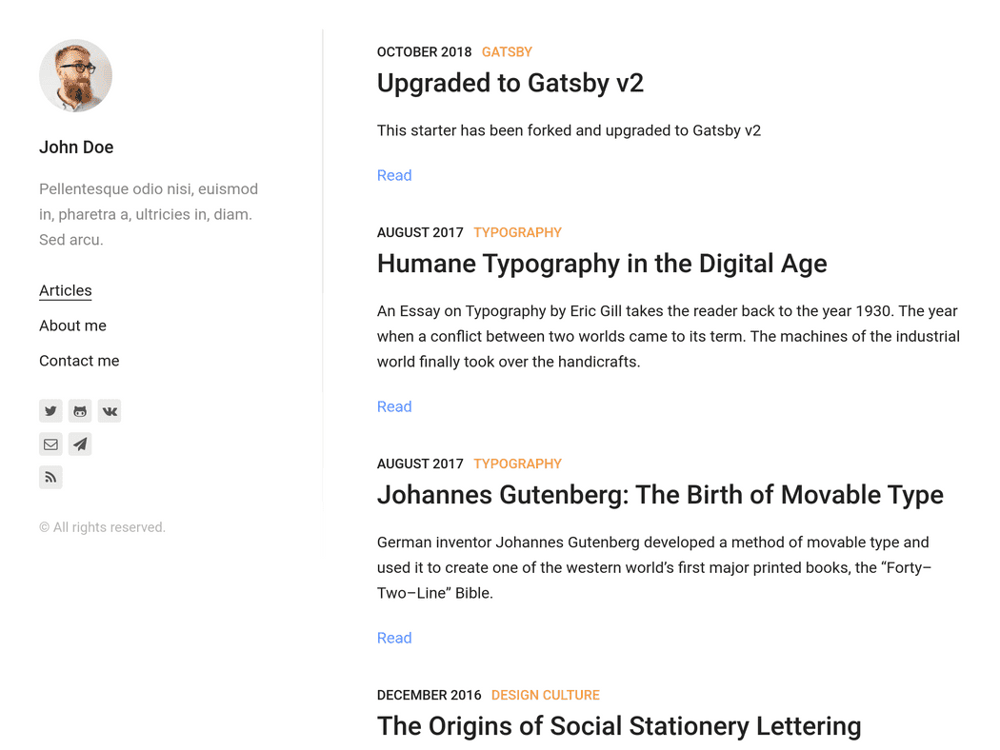
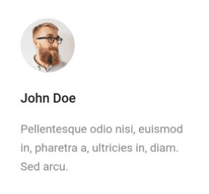
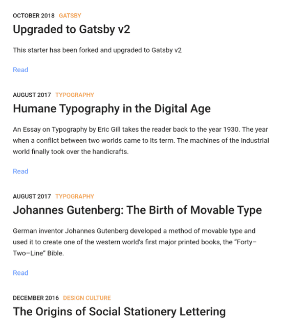

Gatsby 초보인 나는 더욱 쉽게 시작하기 위해 theme를 사용하길 선택했다.... 사실 React 기반이라 처음 시작하기 어렵기도하고 진입장벽이 낮지는 않은 것 같아서..<br>

그래도 여러가지 이유로 Gatsby를 선택했고, lumen이라는 theme를 선택하고 적용해 보면서 단순히 설정조차도 쉽지는 않았다. 그래서 나중에 참고도 할 겸 이번 페이지에 정리를 해보려 한다.

### Gatsby 설치하기

Googling을 하면 많이 나오지만, 먼저 Gatsby를 설치하는 내용부터 다루겠다.

1. Gatsby 설치하기.
    ```js
    $ npm i -g gatsby-cli
    ```
    먼저 위와 같이 작성하여 gatsby를 설치하자.

2. Theme 고르기.

    여기 링크된 [Starter](https://www.gatsbyjs.org/starters/?v=2)로 들어가면 theme를 선택할 수 있다. (*Gatsby Starter*라고 구글에 작성해도 쉽게 찾을 수 있고, 여기서는 lumen만 다루겠다.)<br>

    루멘은 두가지 종류가 있는데 나는 v2라고 쓰여진 것을 선택했다. (더 가볍다고 쓰여있어서..) 찾았으면 깃허브 아이콘을 누르자. 그럼 [여기](https://github.com/gatsbyjs/gatsby.git)와 같은 페이지를 확인할 수 있다. **clone or download**를 눌러 url을 복사해두자.<br>

    이후 Gatby blog 폴더를 만들 곳에 들어가 comman창에 아래와 같이 입력한다.
    ```js
    $ gatsby new [BLOGNAME] https://github.com/GatsbyCentral/gatsby-v2-starter-lumen
    ```
    - new는 새롭게 만든다는 의미일테고 
    - blogname은 컴퓨터에 gatsby blog를 관리할 폴더명
    - 뒤의 Url은 lumen them의 github clone Url이다.

### Gatsby 설정하기.
   
Gatsby를 설치하면 먼저 처음 화면은 아래처럼 나올것이다.


처음에는 아무것도 모르고 성정을 바꾸기 위해 모든 react js 파일들을 뒤져가며 어디에 어떻게 import를 하는지 등의 상관관계를 확인하기 위해 노력했지만, 주변인의 도움으로 간단하게 설정을 할 수 있는 방법을 찾아냈다. 대부분의 설정은 gatsby-config.js파일을 통해 할 수 있다. 먼저 차례대로 알아보자.

  * Profile 바꾸기.

      

      - 사진

          먼저 사진은 ```src/pages/photo.jpg```를 변경하면 된다. 따로 이름을 변경하면 적용이 안되는 것 같아 파일명은 변경하지 않고 내 프로필 사진으로 교체하였다.

      - 이름

          ```gatsby-config.js 파일 내부의 siteMetadata의 author 객체의 name 값을 변경해주면 된다.```
      
      - 블로그 설명 (이름 하단부)

          ```gatsby-config.js 파일 내부의 siteMetadata의 subtitle을 변경해주면 된다.```
  
  * Menu 바꾸기.


      

      - menu명

          ```gatsby-config.js 파일 내부의 siteMetadata에서 menu 배열 속 해당객체의 label 값을 변경해주면 된다.```
      
      - menu 추가

          ```gatsby-config.js 파일 내부의 siteMetadata에서 객체를 복사 후 이름과 path를 정정해 주면 된다.``` 이렇게 한 후 블로그에 게시할 md 파일 안에서 category 값을 menu명과 동일하게 작성하면, 동일한 category의 메뉴만 뜨게된다. (아직 허접이라서 이렇게 참조를 이용한 추가방식 밖에 할 수가 없었다...)
  
  * 게시물에 page에 대해

      
  
      ```
      ---
      title: Gatsby
      date: "2019-05-15T15:00:00.000Z"
      layout: post
      draft: false
      path: "/posts/starting-gatsby/"
      category: "The others"
      tags:
      - "Gatsby"
      - "Web Development"
      - "lumen"
      - "how to start gatsby with lumen theme"
      description: "Gatsby를 시작하면서 겪었던 어려움 때문에, lumen 테마를 적용했을 때 어떻게 설정을 하는지에 대해 배웠던 점을 정리하고자.. 조금은 도움이 되길."
      ---
      ```
      일반적으로 md파일의 시작부에 위와 같은 정보를 가져야 인식되도록 설계되어 있다. <br>
          - title: 게시물의 제목<br>
          - date: 날짜. 게시물 가장 상단부의 날짜 표기도 관련<br>
          - layout: post로 되어 있어야 게시물로 인식<br>
          - draft: 초기값은 false인데 잘 모르겠다.<br>
          - path: 글을 클릭했을 때 설정되는 주소(경로)<br>
          - category: 게시물의 날짜 옆에 주황색 글씨로 앞서 언급한 대로 폴더의 메뉴로도 활용된다.<br>
          - tags: 태그 목록들<br>
          - description: 게시물에 보이는 제목 밑의 작은 글씨<br>

여기까지가 일단 알게된 정보들이고 이정도면 시작하는데 문제는 없을 것이다. 추후 더 알게되는 정보가 있으면 업데이트 하겠다.